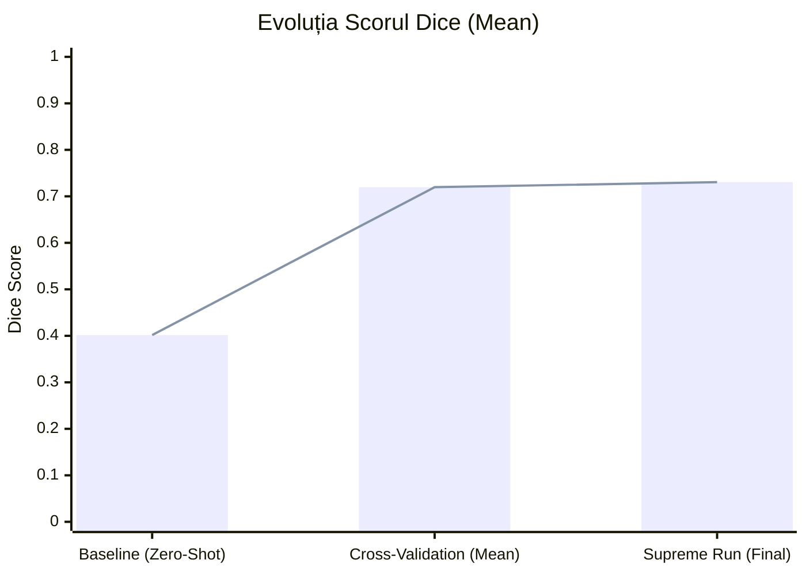
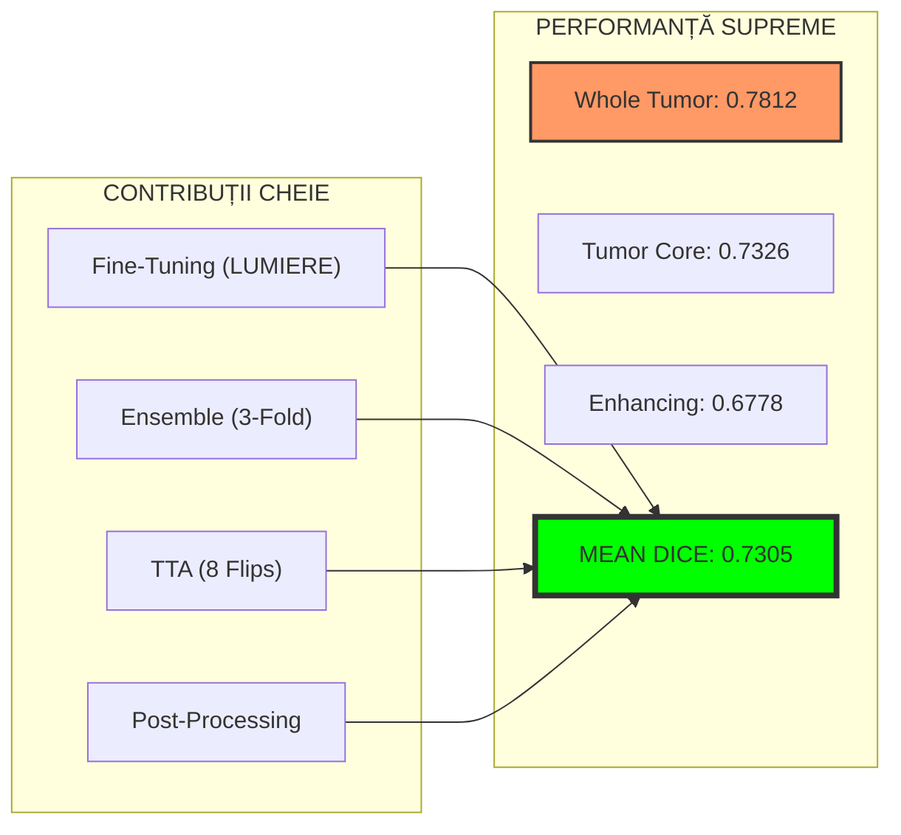

# Raport Final Rezultate Licență - Segmentare Tumori Cerebrale

Acest document conține centralizarea tuturor rezultatelor obținute pe parcursul dezvoltării proiectului, de la antrenarea pe BraTS până la optimizarea finală pe LUMIERE.

## 0. Descrierea Seturilor de Date
Proiectul utilizează două seturi de date majore pentru antrenare și validare clinică.

### BraTS 2024 (Brain Tumor Segmentation Challenge)
*   **Rol:** Set de date pentru pre-antrenare (Sursă).
*   **Pacienți:** ~1350 pacienți (GLI - Glioma).
*   **Modalități MRI:** 4 (T1, T1c, T2, FLAIR).
*   **Caracteristici:** Date înalt standardizate, pre-procesate (skull-stripped, co-registered).
*   **Regiuni:** Necrotic Core (NCR), Peritumoral Edema (ED), Enhancing Tumor (ET).

### LUMIERE (Longitudinal MRI Evaluation)
*   **Rol:** Set de date pentru validare clinică și fine-tuning (Țintă).
*   **Pacienți Unici:** 91 pacienți.
*   **Total Scanări (Vizite):** 599 vizite (studiu longitudinal).
*   **Modalități MRI:** 4 (T1, T1c, T2, FLAIR).
*   **Provocări:** Date clinice reale, variabilitate mare între scanări, rezoluții diferite, prezența artefactelor post-operatorii.

---

## 1. Etapa de Pre-antrenare (Sursa: BraTS 2024)
*Performanța modelului pe setul de date original (date sintetice/curate).*

| Dataset | WT (Whole Tumor) | TC (Tumor Core) | ET (Enhancing) | Mean Dice |
| :--- | :---: | :---: | :---: | :---: |
| **BraTS 2024** (Validation Set) | 0.8114 | 0.7511 | 0.7465 | **0.7697** |

## 2. Etapa de Transfer Direct (Zero-Shot / Baseline)
*Demonstrarea fenomenului de "Domain Shift" prin testarea modelului BraTS direct pe date clinice LUMIERE.*

| Dataset | WT (Whole Tumor) | TC (Tumor Core) | ET (Enhancing) | Mean Dice |
| :--- | :---: | :---: | :---: | :---: |
| **LUMIERE** (Fără Fine-Tuning) | 0.5707 | 0.3899 | 0.2444 | **0.4017** |
| *Diferență față de BraTS* | *-24%* | *-36%* | *-50%* | *-36%* |

## 3. Etapa de Fine-Tuning (Cross-Validation 3-Fold)
*Rezultatele obținute prin antrenarea pe setul de date LUMIERE folosind validare încrucișată.*

| Fold | WT (Whole Tumor) | TC (Tumor Core) | ET (Enhancing) | Mean Dice |
| :--- | :---: | :---: | :---: | :---: |
| Fold 1 | 0.7526 | 0.7014 | 0.6212 | 0.6917 |
| Fold 2 | 0.7601 | 0.7110 | 0.6763 | 0.7158 |
| Fold 3 | 0.7895 | 0.7526 | 0.7121 | 0.7514 |
| **Media (CV)** | **0.7675 ± 0.01** | **0.7217 ± 0.02** | **0.6699 ± 0.03** | **0.7197** |

## 4. Etapa de Optimizare Finală (Supreme Run)
*Impactul tehnicilor avansate: Ensemble, TTA (Test-Time Augmentation) și Post-procesare.*

| Metodă | WT (Whole Tumor) | TC (Tumor Core) | ET (Enhancing) | Mean Dice |
| :--- | :---: | :---: | :---: | :---: |
| Fine-Tuning Simplu (CV Mean) | 0.7675 | 0.7217 | 0.6699 | 0.7197 |
| **Ensemble + TTA + Post-proc** | **0.7812** | **0.7326** | **0.6778** | **0.7305** |
| *Câștig prin Optimizare* | *+1.37%* | *+1.09%* | *+0.79%* | *+1.08%* |

## 5. Vizualizarea Evoluției Performanței
Această diagramă arată saltul de performanță de la modelul de bază (BraTS) la cel optimizat.

## 6. Dashboard-ul Rezultatelor Supreme

## 7. Analiza Longitudinală (Patient-001)
Evoluția volumului tumoral sub tratament, demonstrând utilitatea clinică a modelului.

| Vizită | Volum (mm³) | Status |
| :--- | :---: | :--- |
| week-000-1 | 75,993 | Diagnostic |
| week-000-2 | 111,886 | Progresie |
| week-044 | 32,015 | Răspuns parțial |
| week-056 | 8,321 | Remisie |

---
*Raport generat automat pe 26 Decembrie 2025.*
